# IDStudio — Instructional Designer Workspace

A self-hosted web app for instructional design teams: a full-featured Kanban board,
ID-tailored project management (ADDIE/SAM), a storyboarding suite, a certification &
exam builder, and LMS integration (LearnUpon). Built to run on your own Proxmox server.

Every module lives behind a single **app shell** — a collapsible left-nav sidebar,
a sticky header with breadcrumb navigation, and instant theme switching — so the whole
workspace navigates as one product.

> **Status: Phase 4 in progress (exam builder shipped).** The foundation, the full Kanban
> board, project management (projects with ADDIE/SAM phases, deliverables linked to board
> cards, milestones, SME/stakeholder review cycles, and time tracking), and the storyboarding
> suite (screen-by-screen storyboards with rich-text fields, linked to project deliverables)
> are built and verified. Phase 4's first slice — the **exam builder** (workspace-scoped exams
> with ordered questions, four question types, answer options, and per-exam settings) — is
> built and verified. Up next in Phase 4: exam taking & auto-scoring, then certifications.
> See the **[Roadmap](#roadmap)** below.

## Screenshots

**Kanban board** — columns, cards with labels, due dates, assignees, and checklist / comment / attachment badges:

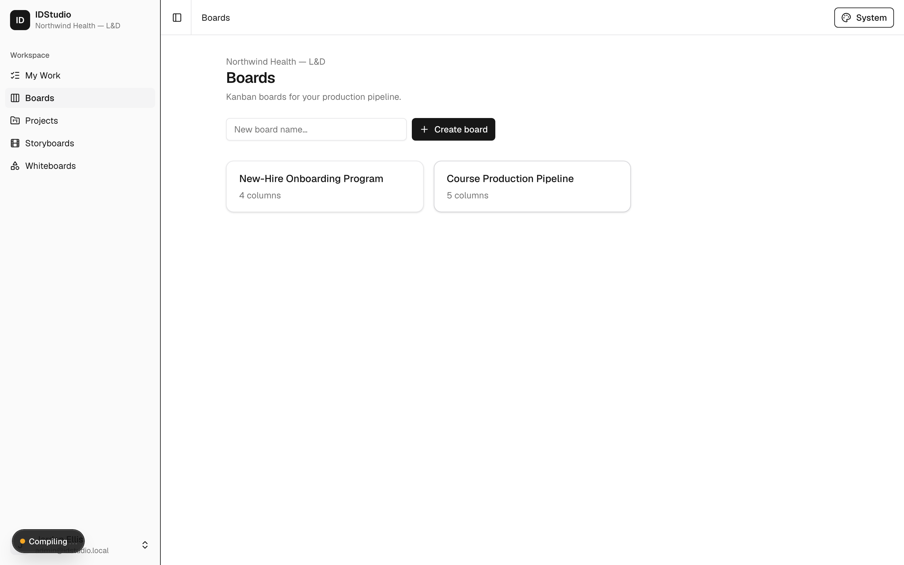

**Card detail** — rich-text description, due date, labels, assignees, checklist, attachments, and comments:

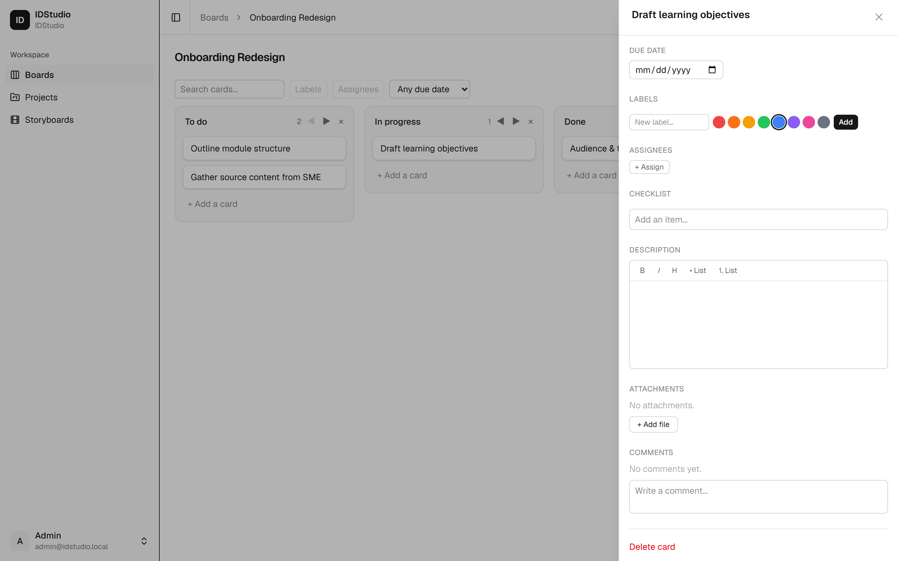

**Dashboard** — workspace, role, and feature modules:

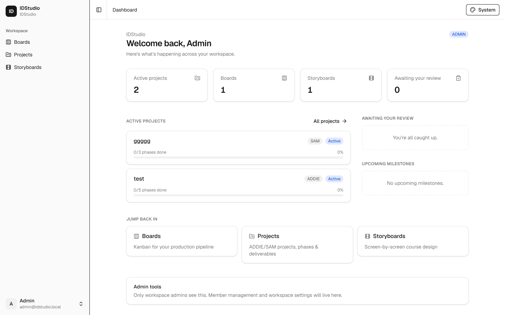

**Projects** — ID-tailored project management: each project carries its methodology (ADDIE/SAM/Custom) and phase progress:

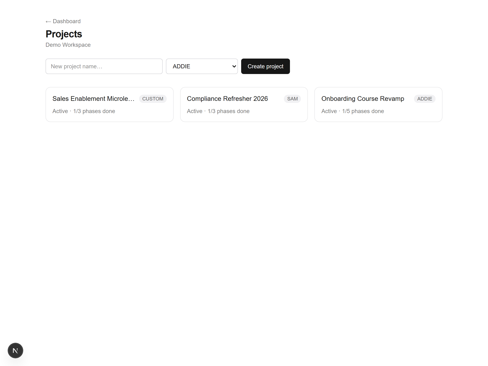

**Project detail** — methodology phases with status and dates, deliverables (linked to board cards) with SME/stakeholder review cycles, milestones, and time tracking:

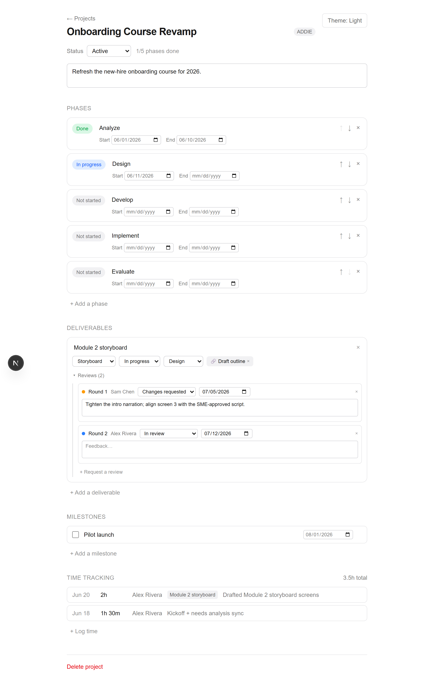

**Color themes** — the whole UI re-themes instantly (the same board across six of the built-in themes):

| Dracula | Nord | Synthwave |
| :-----: | :--: | :-------: |
| 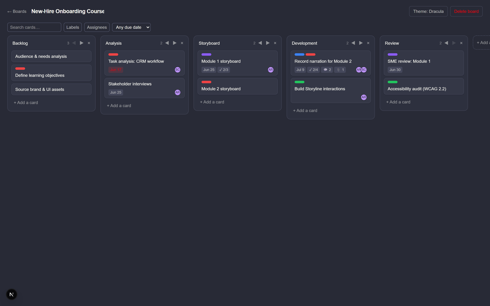 | 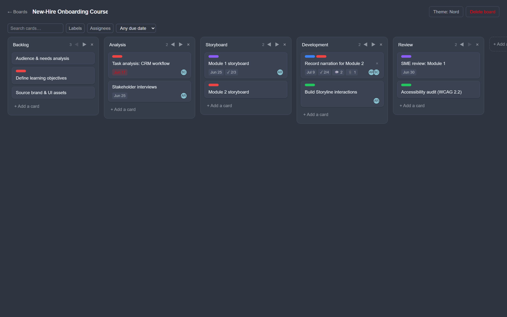 | 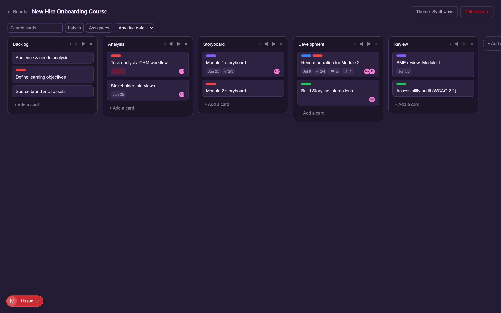 |

| Catppuccin Mocha | Tokyo Night | Gruvbox |
| :--------------: | :---------: | :-----: |
| 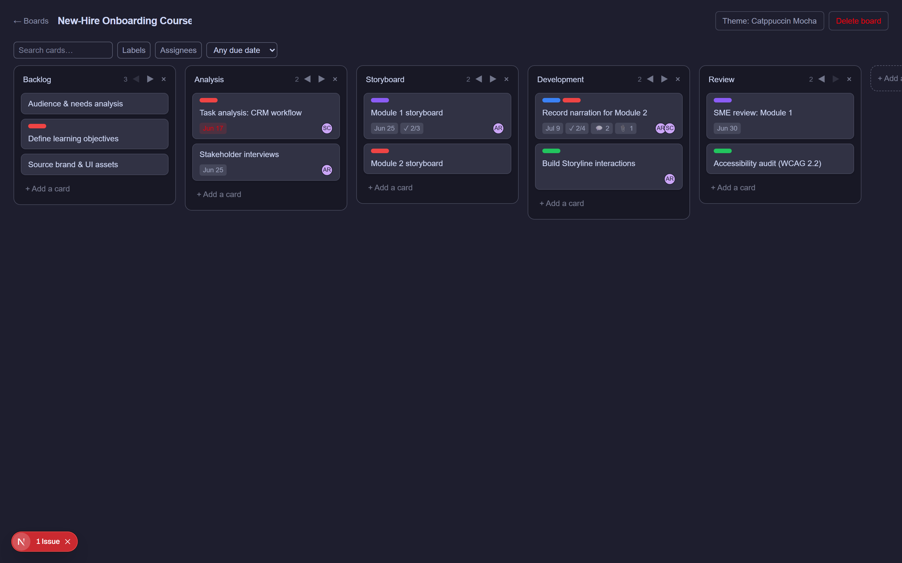 | 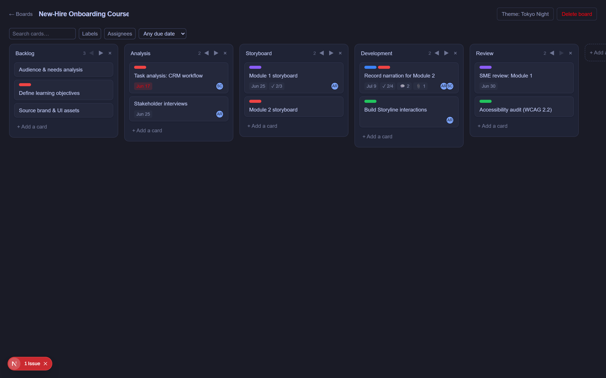 | 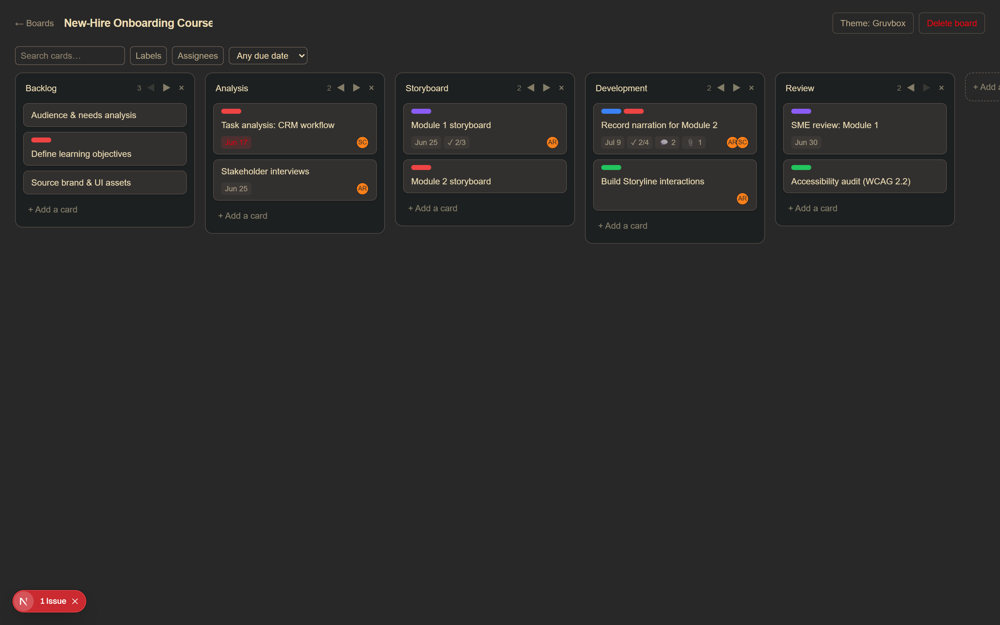 |

## Tech stack

| Layer        | Choice |
| ------------ | ------ |
| Framework    | Next.js 16 (App Router, React 19) — UI, API, Server Actions |
| Language     | TypeScript end to end |
| Database     | PostgreSQL 16 + Prisma 7 (with `@prisma/adapter-pg` driver adapter) |
| Auth         | Email/password, argon2 hashing, signed-JWT sessions (`jose`) + a Data Access Layer. Per-workspace roles (ADMIN / MEMBER) |
| Validation   | Zod 4 |
| Background   | BullMQ + Redis (worker process) |
| Object store | MinIO (S3-compatible) — used from Phase 1 for attachments |
| Reverse proxy| Caddy (automatic HTTPS) |
| Packaging    | Docker Compose |

### A note on auth
We deliberately use the lightweight **`jose` session + Data Access Layer** pattern from the
official Next.js 16 docs rather than NextAuth/Auth.js. NextAuth v5 is still beta and predates
Next 16's "Proxy" (middleware) rename and async request APIs; for a foundation we didn't want
to bet on unproven compatibility. The user-facing result (email/password login + roles) is the
same, and it's fully self-contained. This can be swapped for an auth library later if needed.

## Project layout

```
src/
  app/
    (auth)/login, (auth)/signup   Auth pages
    (app)/                         Authed modules behind one shared shell:
      layout.tsx                   Auth gate + collapsible sidebar + header/breadcrumbs
      dashboard, boards, projects, storyboards, exams
    actions/                       Server Actions (auth, boards, projects, exams, …)
  components/
    app-shell/                     Left-nav sidebar + header breadcrumbs
    ui/                            shadcn/ui primitives (sidebar, dropdown, breadcrumb, …)
    board/ project/ storyboard/ exam/   Feature client components
  hooks/           use-mobile (responsive sidebar)
  lib/
    utils.ts       cn() class-merge helper (clsx + tailwind-merge)
    db.ts        Prisma client (singleton, pg adapter)
    session.ts   jose encrypt/decrypt + session cookie
    dal.ts       Data Access Layer: getCurrentUser / requireUser / requireAdmin
    password.ts  argon2 hash/verify
    validation.ts Zod schemas
  proxy.ts       Next 16 "Proxy" (formerly middleware) — optimistic auth gate
prisma/
  schema.prisma  Models: User, Workspace, Membership, Role
  seed.ts        Idempotent first-admin seed
worker/index.ts  BullMQ worker (LMS sync lands here in Phase 5)
deploy/Caddyfile Reverse-proxy config
Dockerfile       Multi-stage: deps → build → migrate / app / worker
docker-compose.yml
```

## Local development

Prerequisites: Node.js 20+ and Docker.

```bash
# 1. Install dependencies
npm install

# 2. Start Postgres + Redis (and create your env)
cp .env.example .env          # then edit secrets
docker compose up -d postgres redis

# 3. Apply the schema and seed the first admin
npm run db:migrate            # creates/applies migrations
npm run db:seed               # creates admin@idstudio.local / changeme123

# 4. Run the app + (optionally) the worker
npm run dev                   # http://localhost:3000
npm run worker                # in a second terminal
```

Sign in at http://localhost:3000 with the seeded admin, or create a new workspace via **Sign up**.

### Useful scripts
- `npm run build` — production build (standalone output)
- `npm run db:migrate` — create & apply a migration (dev)
- `npm run db:deploy` — apply migrations (prod / CI)
- `npm run db:seed` — seed the first admin (idempotent)

## Deploying to your Proxmox server

See **[docs/DEPLOY-PROXMOX.md](docs/DEPLOY-PROXMOX.md)** for the full walkthrough. In short:
create an Ubuntu VM, install Docker, copy this repo + a filled-in `.env`, point DNS at the VM,
and run `docker compose up -d`. Caddy provisions HTTPS, the `migrate` service applies the schema
and seeds the admin, then the app and worker start.

## Roadmap

- ✅ **Phase 0 — Foundation:** auth, multi-user workspaces with roles, Docker/Proxmox stack
- ✅ **Phase 1 — Kanban:** boards, drag-and-drop, card details (description, due date, labels,
  assignees), checklists, comments, attachments, and filters
- ✅ **Phase 2 — Project management:** projects with ADDIE/SAM phases, deliverables (linked to
  board cards), milestones, SME/stakeholder review cycles, and time tracking
- ✅ **Phase 3 — Storyboarding suite:** workspace-scoped storyboards with ordered screens, per-screen
  type and rich-text fields (on-screen text, narration, visual/interaction/developer notes),
  optionally linked to a project's storyboard deliverable
- 🔨 **Phase 4 — Certifications & exam builder** *(in progress)*
  - ✅ Slice 1 — exam builder: workspace-scoped exams (optionally linked to an `assessment`
    deliverable) with ordered questions, four question types (multiple choice, multiple answer,
    true/false, short answer), answer options, and per-exam settings (passing score, time
    limit, max attempts, shuffle)
  - ⬜ Slice 2 — exam taking & auto-scoring (attempts)
  - ⬜ Slice 3 — certifications (issuance, expiry)
  - ⬜ Slice 4 — reusable question banks
- ⬜ **Phase 5 — LearnUpon integration**

Full detail in `.claude/plans/deep-jumping-treehouse.md`.
