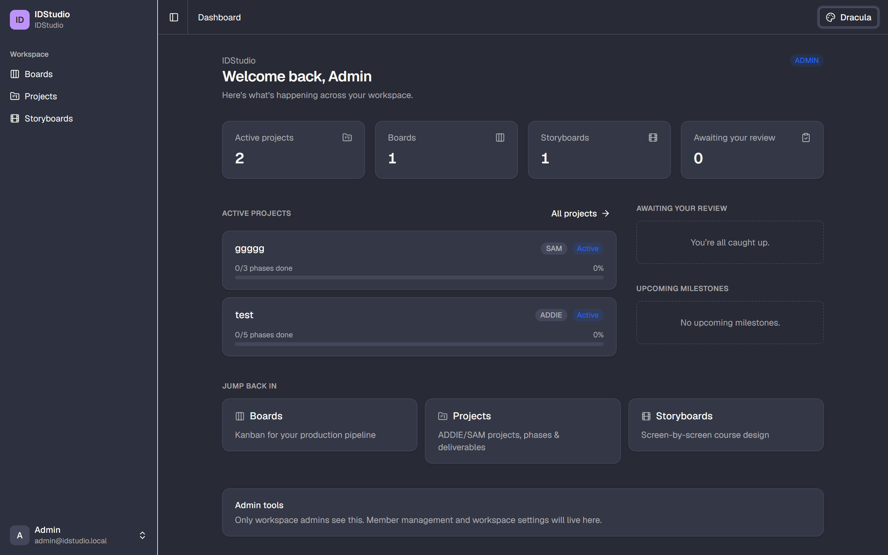
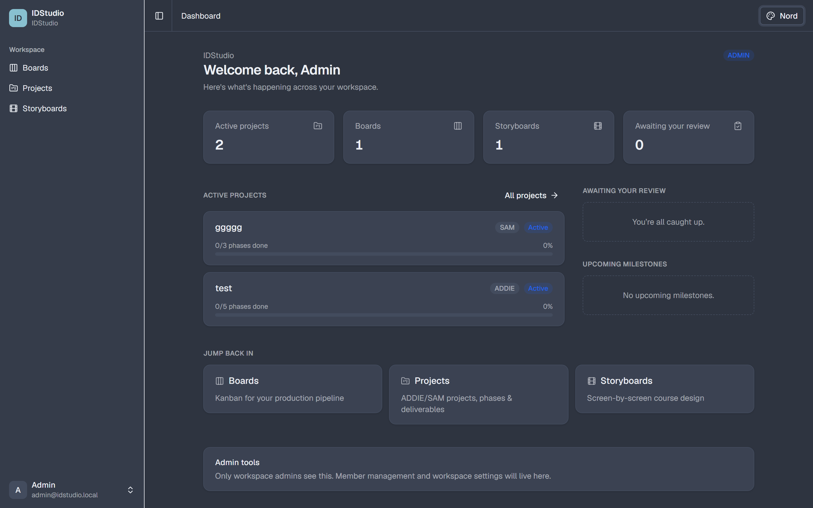
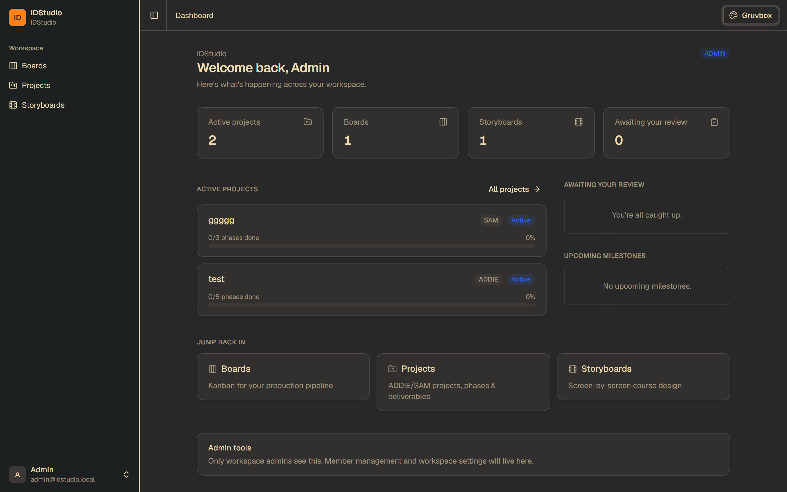
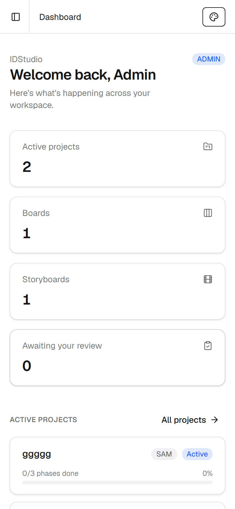
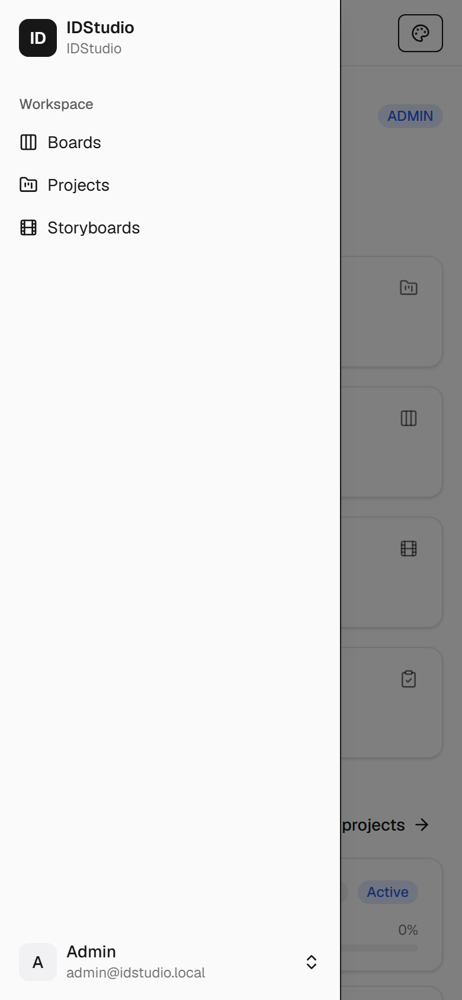

# IDStudio — the operating system for instructional-design teams

A self-hosted workspace that runs the whole instructional-design workflow in one place:
intake the request, plan the project, design the learning, wrangle SMEs to approval, reuse
what works, and prove impact — **sitting above the authoring tools and LMS you already use**,
not trying to replace them.

Built for instructional designers, learning-experience designers, eLearning developers, and
L&D / enablement teams. Runs on your own Proxmox server.

> **Status — core modules shipped; the workflow layer is next.** Multi-user workspaces, a
> full Kanban board, ID-tailored project management (ADDIE/SAM), and a storyboarding suite are
> built and verified, all inside one unified app shell (collapsible left-nav + breadcrumbs) on a
> consistent shadcn/ui design system driving 13 themes. We're now building outward toward the
> full ID operating system — see **[The vision](#the-vision)**.

## Why IDStudio

Instructional designers live in a fragmented toolchain — authoring tools (Storyline, Rise,
Captivate), a generic PM tool, design docs in Word/Slides, assets scattered across Drive, and
an LMS — with **no single source of truth** and a brutal context-switching tax. Generic project
tools don't speak "learning"; authoring tools don't do process, collaboration, or governance.
IDStudio fills that gap: the connective tissue that makes an ID team run.

The deep, under-served needs it's built to solve:

- **SME review & approval** — the #1 daily bottleneck. Feedback scattered across email and PDFs,
  no version control, no deadlines.
- **Intake & demand management** — turn L&D from reactive order-taker into a strategic partner
  with a real request → triage → prioritize pipeline.
- **Objectives → content → assessment alignment** — the ID's craft, today tracked in spreadsheets
  or nowhere. A first-class alignment spine with coverage/gap views.
- **Content lifecycle & reuse** — know what's going stale, what depends on what, and stop
  rebuilding the same templates, scenarios, and assets.
- **Proving impact** — move past completion rates toward structured evaluation (Kirkpatrick) and
  real outcome data.

## Where it fits

IDStudio is deliberately **not** an authoring tool and **not** an LMS. It sits *above* them as
the system of record and collaboration hub — you keep building courses in Storyline/Rise/Captivate
and delivering them in your LMS, and IDStudio orchestrates the work around them (and, eventually,
publishes to the LMS and pulls completion/impact data back).

## What's built today

- **Unified app shell** — collapsible left-nav sidebar, header breadcrumbs, and instant theme
  switching across 13 built-in themes, on a single shadcn/ui design system.
- **Workspaces & roles** — multi-user, per-workspace ADMIN / MEMBER roles, email/password auth.
- **Boards** — a full Kanban: columns, drag-and-drop, card details (rich-text description, due
  date, labels, assignees), checklists, comments, attachments, and filters.
- **Projects** — ID-tailored project management: ADDIE / SAM / custom methodologies, phases with
  status and dates, deliverables (linked to board cards), **SME/stakeholder review cycles**,
  milestones, and time tracking.
- **Storyboards** — screen-by-screen course design with per-screen type and rich-text fields
  (on-screen text, narration, visual / interaction / developer notes), optionally linked to a
  project's storyboard deliverable.
- **Home dashboard** — your workspace at a glance: active projects with phase progress, items
  awaiting your review, and upcoming milestones.

## Screenshots

**Home dashboard** — active projects with phase progress, your review queue, and upcoming milestones:


**Boards** — a full Kanban for your production pipeline:


**Card detail** — rich-text description, due date, labels, assignees, checklist, attachments, and comments:


**Project detail** — ADDIE/SAM phases with status and dates, deliverables, milestones, and time tracking:


**13 built-in themes** — the whole UI re-themes instantly (the dashboard across three of them):

| Dracula | Nord | Gruvbox |
| :-----: | :--: | :-----: |
|  |  |  |

**Responsive** — the shell collapses to a slide-over on mobile:

| Dashboard | Navigation |
| :-------: | :--------: |
|  |  |

## The vision

We're building IDStudio outward into the full operating system for ID teams. The pillars on the
roadmap:

1. **Intake & demand management** — structured request capture, triage, and prioritization; the
   strategic front door to the whole product.
2. **SME review & approval workflows** — deadline-driven, consolidated, asset-anchored review and
   sign-off (building on today's review-cycle foundation).
3. **Objectives → content → assessment alignment spine** — thread learning objectives through
   design, content, and assessment, with coverage and gap analysis.
4. **Content lifecycle & a reusable asset library** — content inventory with review/expiry dates
   and impact analysis, plus a searchable library of templates, scenarios, and question banks.
5. **LMS integration** — publish/sync courses to your LMS and pull completion and assessment data
   back for impact reporting.

> **On scope:** an earlier standalone *exam builder* was removed as off-strategy — building and
> grading assessments is the LMS/authoring tools' job. Assessment lives on in IDStudio as part of
> the alignment spine and the reusable question bank, not as a bespoke exam engine.

## Tech stack

| Layer         | Choice |
| ------------- | ------ |
| Framework     | Next.js 16 (App Router, React 19) — UI, API, and Server Actions |
| Language      | TypeScript end to end |
| UI            | shadcn/ui + Tailwind CSS v4, with a theme-token bridge driving 13 themes |
| Database      | PostgreSQL 16 + Prisma 7 (with the `@prisma/adapter-pg` driver adapter) |
| Auth          | Email/password, argon2 hashing, signed-JWT sessions (`jose`) + a Data Access Layer; per-workspace roles (ADMIN / MEMBER) |
| Validation    | Zod 4 |
| Background    | BullMQ + Redis (worker process) |
| Object store  | MinIO (S3-compatible) — used for attachments |
| Reverse proxy | Caddy (automatic HTTPS) |
| Packaging     | Docker Compose |

### A note on auth

We deliberately use the lightweight **`jose` session + Data Access Layer** pattern from the
official Next.js 16 docs rather than NextAuth/Auth.js. NextAuth v5 is still beta and predates
Next 16's "Proxy" (middleware) rename and async request APIs; for a foundation we didn't want to
bet on unproven compatibility. The user-facing result (email/password login + roles) is the same,
and it's fully self-contained — swappable for an auth library later if needed.

## Project layout

```
src/
  app/
    (auth)/login, (auth)/signup    Auth pages
    (app)/                         Authed modules, all behind one shared shell:
      layout.tsx                   Auth gate + collapsible sidebar + header/breadcrumbs
      loading | error | not-found  In-shell route boundaries
      dashboard, boards, projects, storyboards
    actions/                       Server Actions (auth, boards, cards, projects,
                                   deliverables, storyboards, …)
  components/
    app-shell/                     Sidebar + header breadcrumbs
    shared/                        Cross-cutting UI: PageContainer, PageHeader, EmptyState,
                                   StatusBadge, InlineTitle, ConfirmDelete
    ui/                            shadcn/ui primitives (button, card, dialog, sidebar, …)
    board/ project/ storyboard/    Feature client components
  hooks/         use-mobile (responsive sidebar)
  lib/
    modules.ts   Single module registry — feeds the sidebar, breadcrumbs, and dashboard
    dal.ts       Data Access Layer: getCurrentUser / requireUser / active membership
    db.ts        Prisma client (singleton, pg adapter)
    authz.ts     Resource authorization helpers
    session.ts / password.ts / validation.ts / methodology.ts / storyboard.ts / utils.ts
  generated/prisma   Generated Prisma client (gitignored)
prisma/
  schema.prisma  Data model (workspaces, boards, projects, storyboards, …)
  migrations/    SQL migrations (applied via `prisma migrate deploy`)
  seed.ts        Idempotent first-admin seed
worker/index.ts  BullMQ worker (LMS sync will land here)
deploy/Caddyfile Reverse-proxy config
Dockerfile       Multi-stage: deps → build → migrate / app / worker
docker-compose.yml
```

## Local development

Prerequisites: Node.js 20+ and Docker.

```bash
# 1. Install dependencies
npm install

# 2. Start Postgres + Redis (and create your env)
cp .env.example .env          # then edit secrets
docker compose up -d postgres redis

# 3. Apply the schema and seed the first admin
npm run db:migrate            # create/apply migrations
npm run db:seed               # creates admin@idstudio.local / changeme123

# 4. Run the app + (optionally) the worker
npm run dev                   # http://localhost:3000
npm run worker                # in a second terminal
```

Sign in at http://localhost:3000 with the seeded admin, or create a new workspace via **Sign up**.

### Useful scripts

- `npm run build` — production build (standalone output)
- `npm run db:migrate` — create & apply a migration (dev)
- `npm run db:deploy` — apply migrations (prod / CI)
- `npm run db:seed` — seed the first admin (idempotent)
- `npm run lint` — ESLint

## Deploying to your Proxmox server

See **[docs/DEPLOY-PROXMOX.md](docs/DEPLOY-PROXMOX.md)** for the full walkthrough. In short:
create an Ubuntu VM, install Docker, copy this repo + a filled-in `.env`, point DNS (or an IP)
at the VM, and run `docker compose up -d`. Caddy provisions HTTPS, the `migrate` service applies
the schema and seeds the admin, then the app and worker start.
