# IDStudio — the operating system for instructional-design teams

A self-hosted workspace that runs the whole instructional-design workflow in one place:
intake the request, plan the project, design the learning, wrangle SMEs to approval, keep the
team moving in sprints, and align every objective to content and assessment — **sitting above
the authoring tools and LMS you already use**, not trying to replace them.

Built for instructional designers, learning-experience designers, eLearning developers, and
L&D / enablement teams. Runs on your own Proxmox server.

> **Status — the ID workflow layer is live.** Multi-user workspaces, a full Kanban board,
> ID-tailored project management (ADDIE/SAM), a storyboarding suite, collaborative whiteboards,
> a stakeholder **intake queue**, **SME review cycles**, an **objectives → content → assessment
> alignment spine**, **team sprints**, **email notifications** (with @-mentions), and team &
> access management — all inside one unified app shell (collapsible left-nav + breadcrumbs) on a
> consistent shadcn/ui design system driving **17 themes**. Remaining pillars: content
> lifecycle / reuse and LMS integration — see **[The vision](#the-vision)**.

## Why IDStudio

Instructional designers live in a fragmented toolchain — authoring tools (Storyline, Rise,
Captivate), a generic PM tool, design docs in Word/Slides, assets scattered across Drive, and
an LMS — with **no single source of truth** and a brutal context-switching tax. Generic project
tools don't speak "learning"; authoring tools don't do process, collaboration, or governance.
IDStudio fills that gap: the connective tissue that makes an ID team run.

The deep, under-served needs it's built to solve:

- **SME review & approval** — the #1 daily bottleneck. Feedback scattered across email and PDFs,
  no version control, no deadlines. → Deadline-driven, round-tracked **review cycles** with an
  approve / request-changes loop surfaced in each reviewer's My Work.
- **Intake & demand management** — turn L&D from reactive order-taker into a strategic partner.
  → A public **intake form** feeding a triage → impact/effort scoring → approve-to-project pipeline.
- **Objectives → content → assessment alignment** — the ID's craft, today tracked in spreadsheets
  or nowhere. → A first-class **alignment spine** threading objectives through storyboard screens
  and assessment items, with coverage/gap views.
- **Content lifecycle & reuse** — know what's going stale, what depends on what, and stop
  rebuilding the same templates, scenarios, and assets. *(On the roadmap.)*
- **Proving impact** — move past completion rates toward structured evaluation and real outcome
  data. *(On the roadmap, via LMS integration.)*

## Where it fits

IDStudio is deliberately **not** an authoring tool and **not** an LMS. It sits *above* them as
the system of record and collaboration hub — you keep building courses in Storyline/Rise/Captivate
and delivering them in your LMS, and IDStudio orchestrates the work around them (and, eventually,
publishes to the LMS and pulls completion/impact data back).

## What's built today

- **Unified app shell** — collapsible left-nav sidebar, header breadcrumbs, global search
  (`⌘K` command palette), a **+ New** quick-create, and instant theme switching across **17
  built-in themes**, on a single shadcn/ui design system.
- **Workspaces, members & groups** — multi-user workspaces with three per-workspace roles
  (**ADMIN / MANAGER / MEMBER**) and email/password auth. Admins provision members (create users
  with an initial password, reset passwords, change roles, remove members) and organize them into
  groups; managers get admin-level visibility without the admin controls; every user changes their
  own password and picks a theme from **Settings → Account**.
- **Group-based access control** — boards, storyboards, projects, and whiteboards are visible to
  all members by default, but can be restricted to specific groups (admins and managers always
  retain visibility). Enforced everywhere — lists, dashboard, search, and direct links — not just
  hidden in the UI.
- **Intake** — a shareable public request form (per-workspace, toggleable) feeding a triage queue:
  score requests by **impact / effort**, assign an owner, then **approve → convert to a project**
  or reject with a reason. Requesters get emailed confirmations and decisions automatically.
- **Boards** — a full Kanban: columns, drag-and-drop, and rich cards — rich-text description with
  **@-mentions**, due dates, labels, **assignees and SMEs**, a canonical **status** kept in sync
  with the column, optional **sprint** assignment, sub-task checklists, rich-text comments (with
  @-mentions), file attachments, linked whiteboards, and stacking filters.
- **Projects** — ID-tailored project management: ADDIE / SAM / custom methodologies, phases with
  status and dates, deliverables (linked to board cards and storyboards), **SME/stakeholder review
  cycles**, milestones, and time tracking — with optional per-project sprint planning.
- **Sprints** — workspace-level, time-boxed iterations (planned → active → completed) with a goal
  and dates, and a **team sprint board** that pulls cards across boards into one view grouped by
  canonical status.
- **Alignment spine** — write measurable **learning objectives** on a project and thread them
  through storyboard **screens** and **assessment items**, with coverage/gap analysis so you can
  see what's unassessed or untaught.
- **Storyboards** — screen-by-screen course design with per-screen type and rich-text fields
  (on-screen text, narration, visual / interaction / developer notes), optionally linked to a
  project's storyboard deliverable.
- **Whiteboards** — collaborative Excalidraw canvases for sketching workflows, wireframes, and
  ideas; autosaved, and optionally linked to a storyboard or spun up straight from a board card.
- **My Work** — a personal hub of everything waiting on you: reviews awaiting your decision
  (approve / request changes inline), reviews you've requested, assigned cards, and upcoming
  milestones — plus a **Review History** tab with outcomes, feedback, and undo.
- **Email notifications** — the team is emailed on assignments, status changes, comments,
  @-mentions, review requests and decisions, intake, member accounts, and day-before due-date
  reminders. Every email deep-links back into the app, self-actions are skipped, and admins
  toggle any category on or off per workspace in **Settings → Notifications**.
- **Home dashboard** — your workspace at a glance: active projects with phase progress, items
  awaiting your review, and upcoming milestones.
- **Workspace admin** — built-in **backup & restore** of a workspace, and a one-click
  **self-update** flow (pull, rebuild, migrate) from **Settings → Updates**.
- **In-app Help** — a full guide library (Getting started, ADDIE & SAM, Objectives & alignment,
  and a walkthrough for every module) rendered from the same design system.

## Screenshots

**Home dashboard** — active projects with phase progress, your review queue, and upcoming milestones:

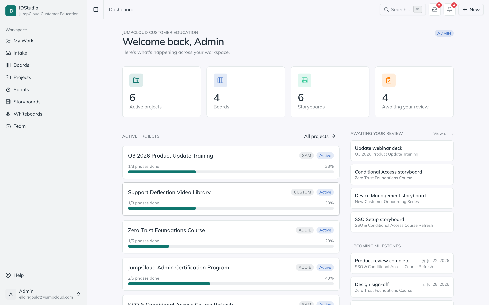

**My Work** — reviews awaiting your decision (approve / request changes inline), reviews you've requested, assigned action items, and upcoming milestones — with a Review History tab:

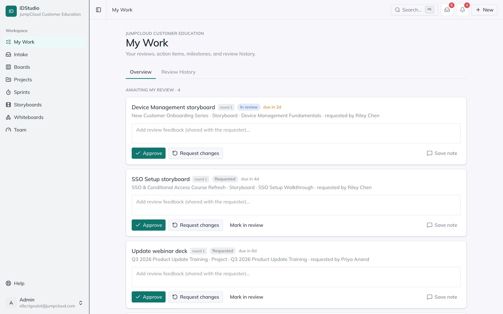

**Boards** — a full Kanban for your production pipeline:

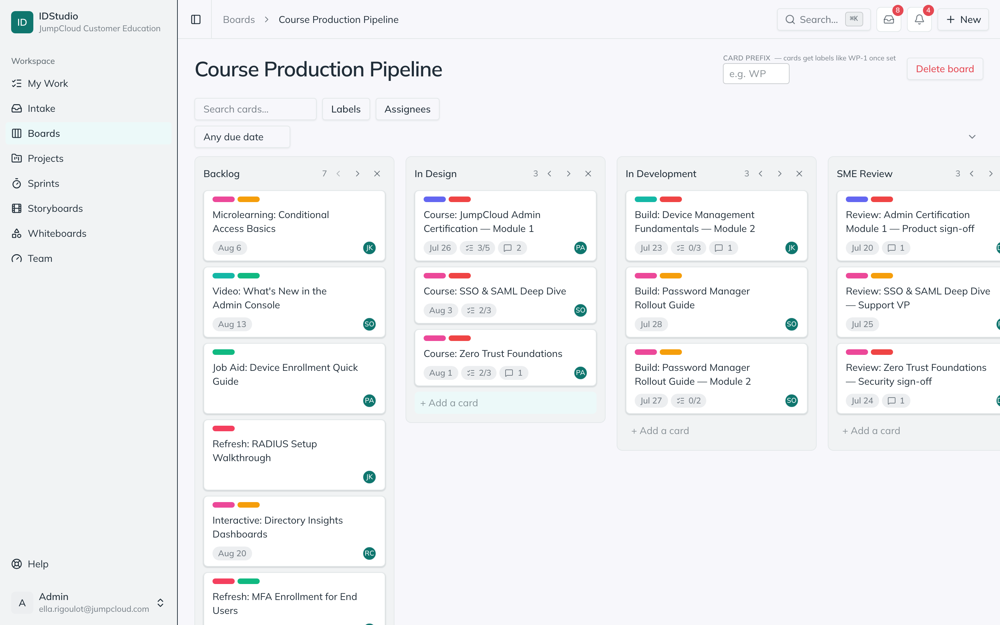

**Card detail** — rich-text description with @-mentions, due date, labels, assignees, SMEs, canonical status, sprint, sub-tasks, attachments, and comments:

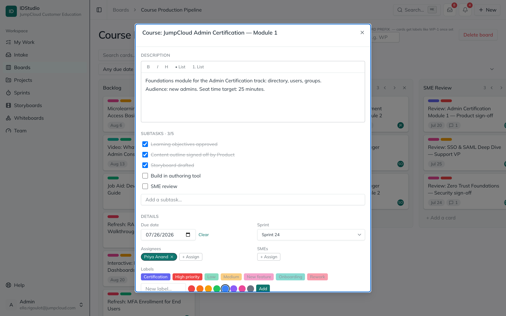

**Project detail** — ADDIE/SAM phases with status and dates, deliverables, review cycles, milestones, and time tracking:

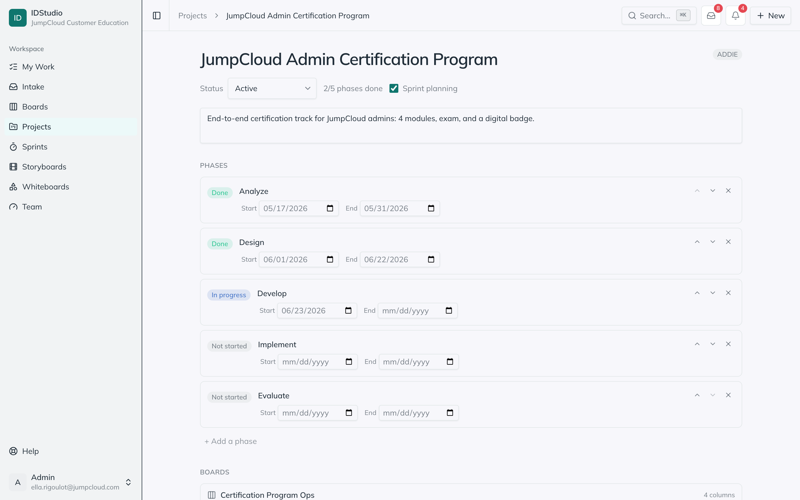

**Sprints** — the team sprint board: cards pulled across boards into one iteration, grouped by canonical status:

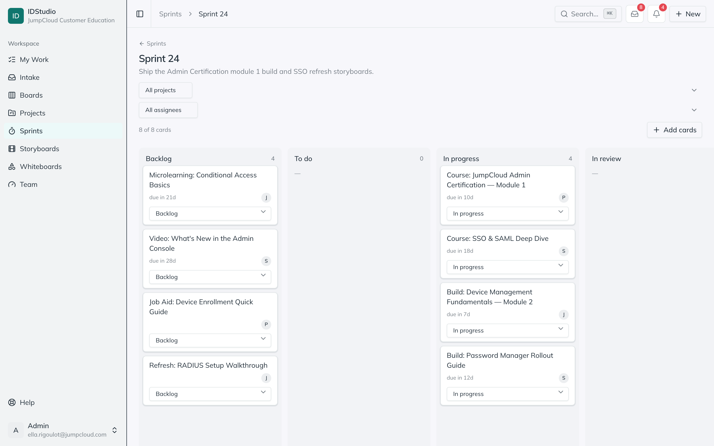

**Intake** — a triage queue for stakeholder requests, scored by impact and effort and converted straight into projects:

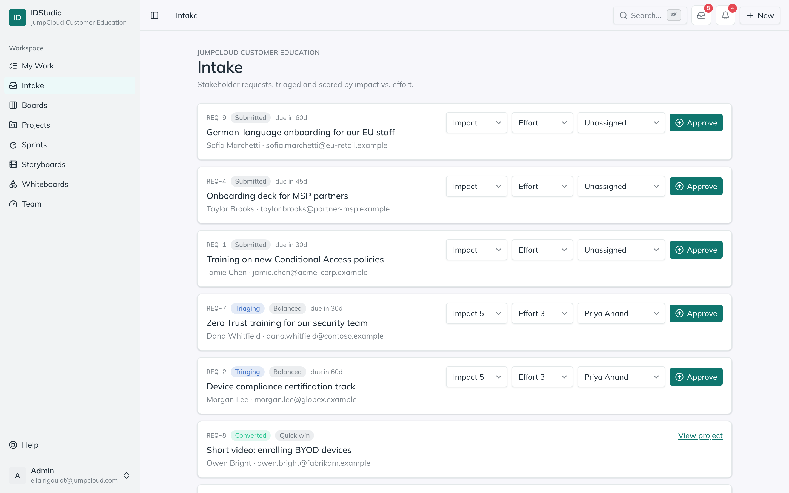

**Storyboards** — screen-by-screen course design with rich per-screen fields:

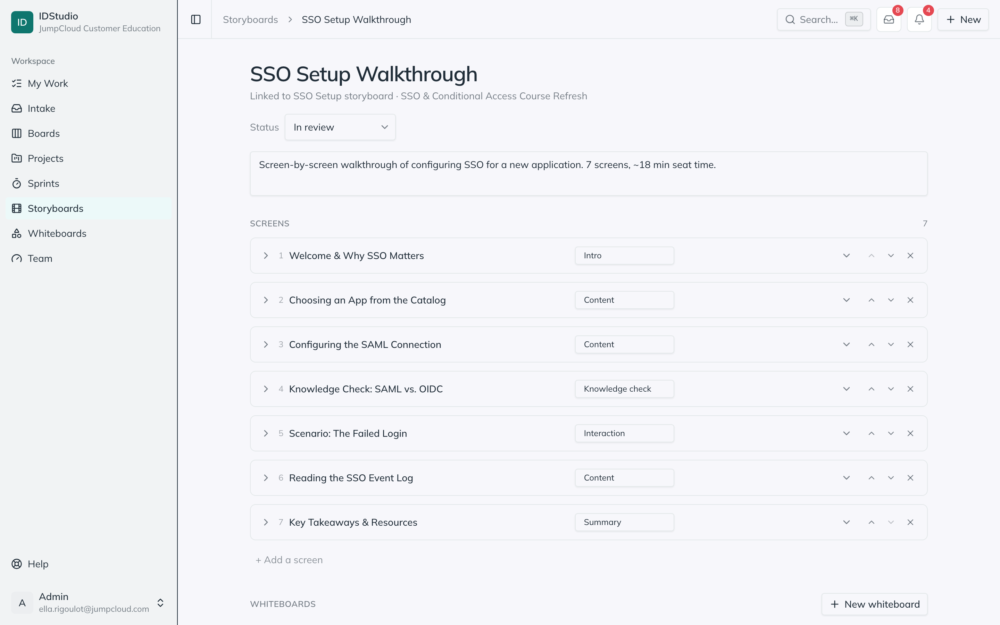

**Whiteboards** — collaborative Excalidraw canvases for sketching workflows, wireframes, and ideas, optionally linked to a storyboard:

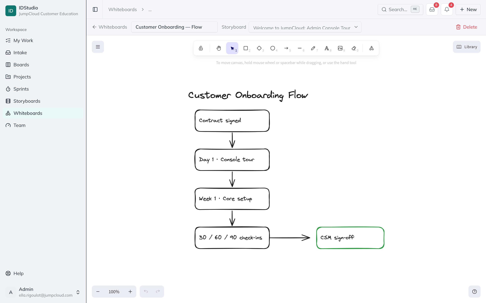

**Notifications** — admins choose exactly what sends an email, per workspace:

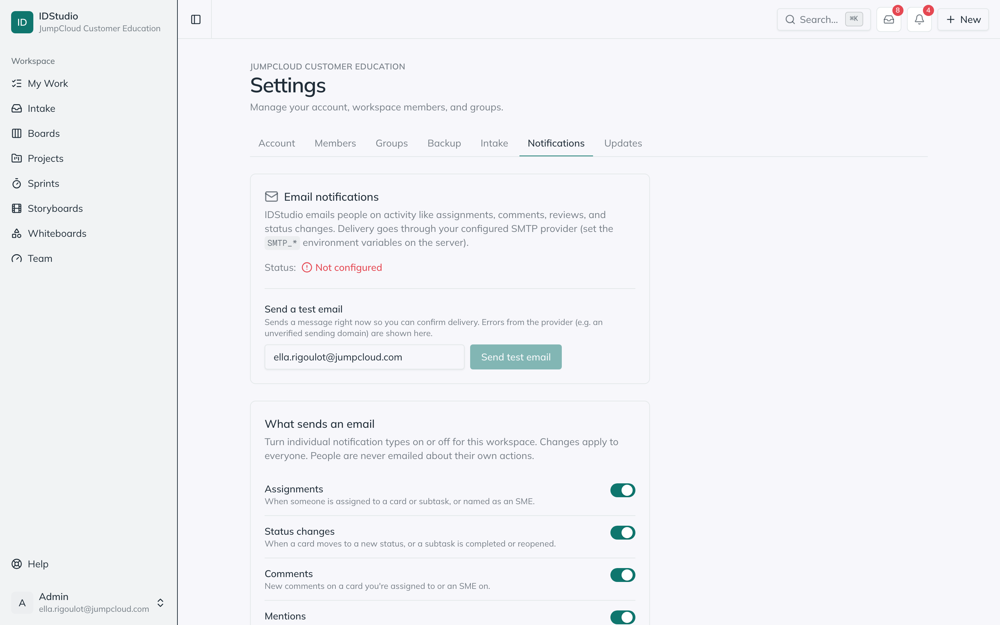

**17 built-in themes** — the whole UI re-themes instantly (the dashboard across three of them):

| Dracula | Nord | Gruvbox |
| :-----: | :--: | :-----: |
| 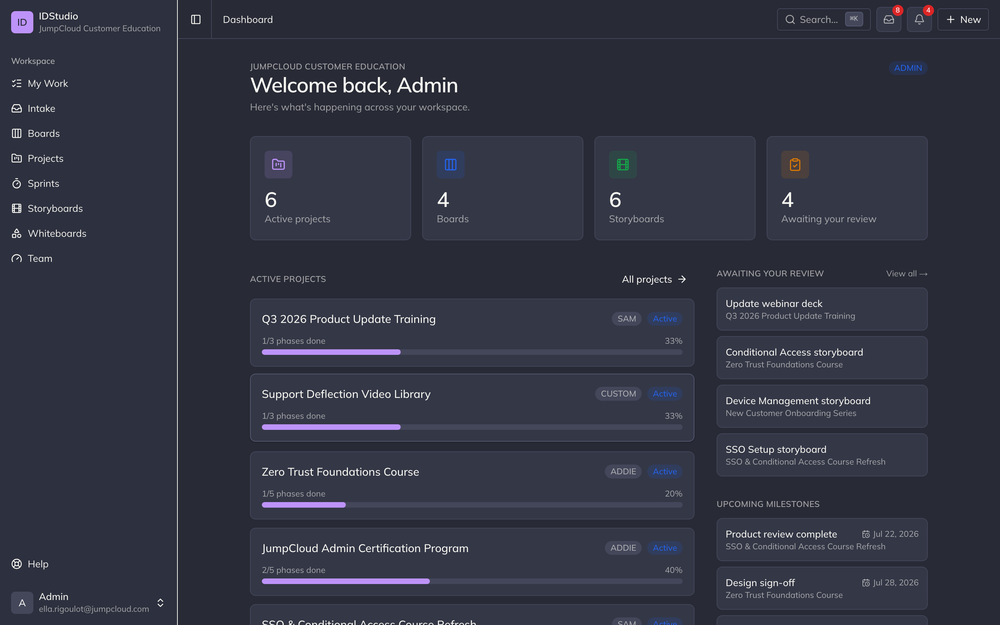 | 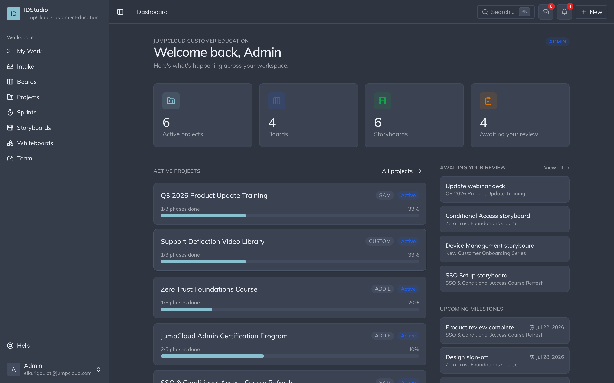 | 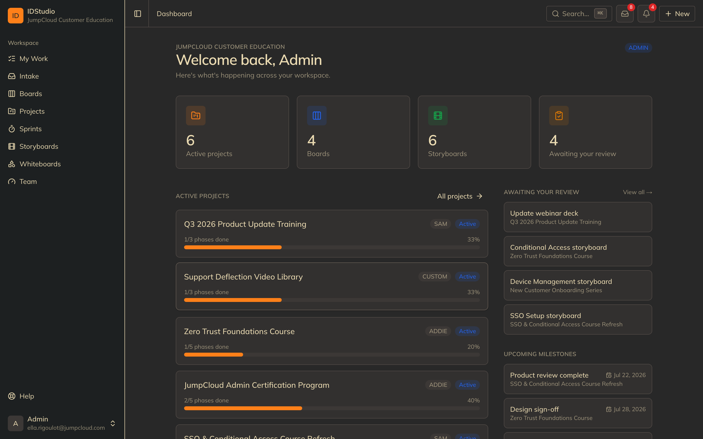 |

**Responsive** — the shell collapses to a slide-over on mobile:

| Dashboard | Navigation |
| :-------: | :--------: |
| 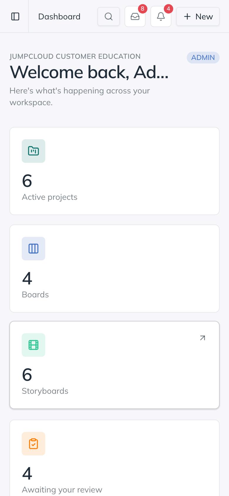 | 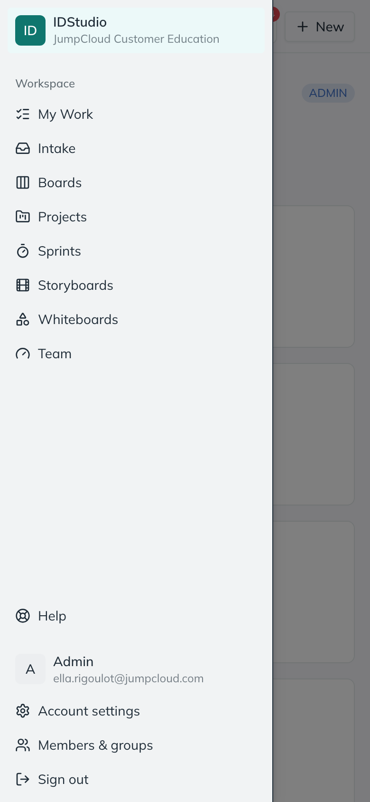 |

## The vision

IDStudio is built around five pillars for the full ID operating system. Three are live; two are
next:

1. **Intake & demand management** ✅ — structured request capture, triage, impact/effort scoring,
   and approve-to-project conversion.
2. **SME review & approval workflows** ✅ — deadline-driven, round-tracked review cycles with an
   approve / request-changes loop and email notifications.
3. **Objectives → content → assessment alignment spine** ✅ — objectives threaded through
   storyboard screens and assessment items, with coverage and gap analysis.
4. **Content lifecycle & a reusable asset library** — content inventory with review/expiry dates
   and impact analysis, plus a searchable library of templates, scenarios, and question banks.
5. **LMS integration** — publish/sync courses to your LMS and pull completion and assessment data
   back for impact reporting.

> **On scope:** an earlier standalone *exam builder* was removed as off-strategy — building and
> grading assessments is the LMS/authoring tools' job. Assessment lives on in IDStudio as part of
> the alignment spine and the reusable question bank, not as a bespoke exam engine. (A
> course-authoring module was likewise removed for the same reason.)

## Tech stack

| Layer         | Choice |
| ------------- | ------ |
| Framework     | Next.js 16 (App Router, React 19) — UI, API routes, and Server Actions |
| Language      | TypeScript end to end |
| UI            | shadcn/ui + Tailwind CSS v4, with a theme-token bridge driving 17 themes |
| Rich text     | TipTap 3 (descriptions & comments, with an @-mention extension) |
| Whiteboards   | Excalidraw |
| Database      | PostgreSQL 16 + Prisma 7 (with the `@prisma/adapter-pg` driver adapter) |
| Auth          | Email/password, argon2 hashing (`@node-rs/argon2`), signed-JWT sessions (`jose`) + a Data Access Layer; per-workspace roles (ADMIN / MANAGER / MEMBER) |
| Validation    | Zod 4 |
| Background    | BullMQ + Redis worker — sends queued notification email (nodemailer) and runs the daily due-date reminder job |
| Object store  | S3-compatible (MinIO), via the AWS SDK with presigned uploads/downloads — used for attachments |
| Ordering      | Fractional indexing for drag-and-drop positions (columns, cards, phases, …) |
| Reverse proxy | Caddy (automatic HTTPS) |
| Packaging     | Docker Compose (Postgres, Redis, MinIO, app, worker, Caddy) |
| Testing/tools | Playwright (used to capture the screenshots above) |

### A note on auth

We deliberately use the lightweight **`jose` session + Data Access Layer** pattern from the
official Next.js 16 docs rather than NextAuth/Auth.js. NextAuth v5 is still beta and predates
Next 16's "Proxy" (middleware) rename and async request APIs; for a foundation we didn't want to
bet on unproven compatibility. The user-facing result (email/password login + roles) is the same,
and it's fully self-contained — swappable for an auth library later if needed.

## Project layout

```
src/
  app/
    (auth)/login, (auth)/signup    Auth pages
    request/[slug]                 Public intake form (the one unauthenticated app route)
    (app)/                         Authed modules, all behind one shared shell:
      layout.tsx                   Auth gate + collapsible sidebar + header/breadcrumbs
      loading | error | not-found  In-shell route boundaries
      dashboard, my-work, intake, boards, projects, sprints,
      storyboards, whiteboards, team
      c/[key]                      Card short-link resolver
      settings/                    Account (all users) + Members, Groups, Intake,
                                   Notifications, Backup, Updates (admin)
    api/search                     Global search endpoint (⌘K)
    actions/                       Server Actions (auth, account, members, groups, access,
                                   boards, cards, projects, reviews, sprints, storyboards,
                                   whiteboards, intake, notifications, …)
  components/
    app-shell/                     Sidebar, header breadcrumbs, command palette, quick-create
    board/ project/ storyboard/    Feature client components (incl. the TipTap editors + mentions)
    settings/ help/                Settings panels + the in-app Help topic library
    shared/ ui/                    Cross-cutting UI + shadcn/ui primitives
  lib/
    modules.ts     Single module registry — feeds the sidebar, breadcrumbs, and dashboard
    dal.ts         Data Access Layer: getCurrentUser / requireUser / active membership
    db.ts          Prisma client (singleton, pg adapter; server-only)
    authz.ts       Resource authorization + group-based access (default-open) helpers
    notifications.ts / notify.ts   Notification type registry + the app-side send gate
    email-templates.ts / mailer.ts / queues.ts   Email bodies, transport, and the BullMQ queue
    reminders.ts   Daily due-date reminder scan (run by the worker)
    mentions.ts    @-mention parsing/rendering for TipTap docs
    status.ts / sprint.ts / methodology.ts / storyboard.ts   Domain vocabularies
    workspace-backup.ts   Workspace export/import
    session.ts / password.ts / validation.ts / app-url.ts / utils.ts
  generated/prisma   Generated Prisma client (gitignored)
prisma/
  schema.prisma  Data model (workspaces, members, groups, boards, projects, sprints,
                 storyboards, objectives, assessment items, intake, reviews, …)
  migrations/    SQL migrations (applied via `prisma migrate deploy`)
  seed.ts        Idempotent first-admin seed  (*-demo-seed.ts: optional demo content)
worker/index.ts  BullMQ worker — sends notification email + runs the reminder job (LMS sync lands here)
deploy/          Caddyfile + the host self-update agent
Dockerfile       Multi-stage: deps → build → migrate / app / worker
docker-compose.yml
```

## Local development

Prerequisites: Node.js 20+ and Docker.

```bash
# 1. Install dependencies
npm install

# 2. Start Postgres + Redis (and create your env)
cp .env.example .env          # then edit secrets
docker compose up -d postgres redis

# 3. Apply the schema and seed the first admin
npm run db:migrate            # create/apply migrations
npm run db:seed               # creates admin@idstudio.local / changeme123

# 4. Run the app + (optionally) the worker
npm run dev                   # http://localhost:3000
npm run worker                # in a second terminal — sends email + runs reminders
```

Sign in at http://localhost:3000 with the seeded admin, or create a new workspace via **Sign up**.
Email notifications require SMTP (`SMTP_*`) to be configured and the worker running; without them
the app works fully, it just doesn't send mail.

### Useful scripts

- `npm run build` — production build (standalone output)
- `npm run db:migrate` — create & apply a migration (dev)
- `npm run db:deploy` — apply migrations (prod / CI)
- `npm run db:seed` — seed the first admin (idempotent)
- `npm run lint` — ESLint

## Deploying to your Proxmox server

See **[docs/DEPLOY-PROXMOX.md](docs/DEPLOY-PROXMOX.md)** for the full walkthrough. In short:
create an Ubuntu VM, install Docker, copy this repo + a filled-in `.env`, point DNS (or an IP)
at the VM, and run `docker compose up -d`. Caddy provisions HTTPS, the `migrate` service applies
the schema and seeds the admin, then the app and worker start. Once running, admins can pull
future updates from **Settings → Updates** without touching the shell.
